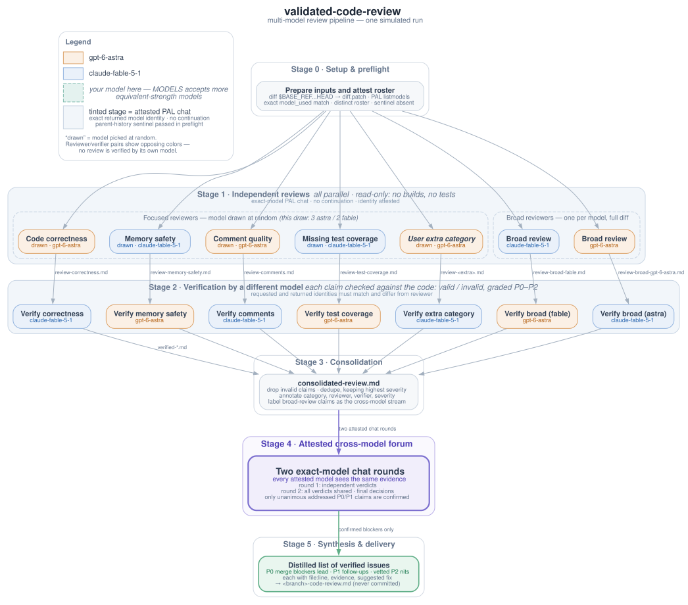

# validated-code-review

An agent skill that runs a multi-model, multi-stage code review of the current
branch before a pull request goes up for human review. History-isolated,
exact-model calls scan the diff in parallel, a different attested model verifies
every claim against the actual code, and a two-round forum settles disputed
calls. The result is one distilled document that leads with merge blockers.

The review is strictly read-only. No agent in the pipeline builds the project or runs tests. Every claim must be supported by citing code.

## Contents

1. [Quick start](#1-quick-start)
2. [Pipeline at a glance](#2-pipeline-at-a-glance)
3. [Stage by stage](#3-stage-by-stage)
4. [Design rationale](#4-design-rationale)
   1. [Verified history isolation](#41-verified-history-isolation)
   2. [Exact model attestation](#42-exact-model-attestation)
   3. [Attested forum](#43-attested-forum)
5. [Inputs and configuration](#5-inputs-and-configuration)
6. [Output](#6-output)
7. [Repository layout](#7-repository-layout)
8. [Installation](#8-installation)
9. [Requirements](#9-requirements)

## 1. Quick start

From a Claude Code session on the branch you want reviewed, ask for a validated review. The word "validated" is the trigger:

```
run a validated code review
```

Common variations:

```
run a validated code review against origin/feature-part-1
run a validated code review, add a concurrency category
run a validated code review with claude-fable-5 and gpt-5.6-sol
```

The review takes a while because it launches many model calls. When it finishes,
read `<branch>-code-review.md` in the repository root.

## 2. Pipeline at a glance

The diagram below shows one simulated run with the default two-model list. Each focused reviewer's model is drawn at random, and every review is verified by a model other than the one that wrote it, which is why each reviewer and verifier pair shows opposing colors.



The source for this diagram is `assets/validated-code-review-stages.dot`. Regenerate the SVG after editing it:

```bash
dot -Tsvg assets/validated-code-review-stages.dot -o assets/validated-code-review-stages.svg
```

## 3. Stage by stage

| Stage | Name | What happens |
|-------|------|--------------|
| 0 | Setup and preflight | Fetch the remote, freeze the diff, require every exact model, and attest returned identities plus no-parent-history behavior. |
| 1 | Independent reviews | Focused reviewers (correctness, memory safety, comment quality, test coverage, plus any user extras) and one broad reviewer per model all run in parallel. Each writes its own claims file. |
| 2 | Verification | Every review file is checked claim by claim against the real code by a different model. Surviving claims are graded P0 through P2. |
| 3 | Consolidation | Invalid claims are dropped, duplicates are merged at the highest severity, and every claim is annotated with its reviewer, verifier, and verification outcome. |
| 4 | Attested forum | Every exact model considers the claims, sees the first-round verdicts, and returns an attested final decision. |
| 5 | Synthesis | The confirmed findings become one document: P0 merge blockers first, P1 follow-ups next, vetted P2 nits last. Each finding carries a file and line reference, evidence, and a suggested fix. |

The severity scale is simple. P0 means the branch must not merge until the issue is fixed. P1 means the issue is real but not blocking. P2 covers minor and stylistic points.

## 4. Design rationale

Three decisions shape this skill: history isolation is verified instead of
assumed, exact model identity is checked from transport metadata, and disputed
claims are settled by an attested forum rather than by the orchestrator.

### 4.1 Verified history isolation

Whether a child inherits the parent transcript is runner-dependent. This skill
uses PAL chat calls without continuation IDs and preflights the actual transport
with a parent-history sentinel on every roster model. A separate context window
is not treated as evidence by itself. If any probe fails, the review aborts.

Each reviewer gets only the frozen diff, relevant full source files, and its own
brief. Reviewer outputs are withheld from one another until the forum. This
keeps the orchestrator small and prevents agreement in the independent stages
from being a transcript echo.

### 4.2 Exact model attestation

PAL clink chooses a CLI name and role; the selected CLI preset owns its model.
That route cannot prove an exact roster identity. The skill therefore uses PAL
`listmodels` for discovery and PAL `chat` with an exact `model` selector for
every review call. Its helper checks the returned `metadata.model_used` value
against the request and records the result. Missing, substituted, duplicated,
or unidentified roster entries abort instead of falling back.

Cross-model diversity is the point of the whole design. Different models have
different blind spots, and a single model verifying its own claims tends to
agree with itself. The skill therefore enforces one hard rule: no review is
ever verified by the same exact model identity that wrote it. A claim raised by
one exact model and confirmed against the code by another has survived a much
stronger filter than either model could provide alone.

### 4.3 Attested forum

Verification in Stage 2 is mechanical: a claim either matches the code or it does not. What remains after consolidation is the judgment layer. Whether a confirmed issue truly blocks a merge, or whether a P1 deserves promotion or demotion, is not something a single verifier should decide.

PAL consensus reports its requested roster but not a returned `model_used`
identity for each consultation. Stage 4 therefore uses two PAL chat rounds. In
the first, every attested model judges the same evidence independently. In the
second, every model sees all first-round verdicts and returns a final decision.
A P0 or P1 is forum-confirmed only when every final response that addresses it
agrees; disagreements remain visible and non-blocking.

## 5. Inputs and configuration

All configuration is conversational. State overrides in the same message that requests the review.

| Input | Default | Notes |
|-------|---------|-------|
| Model list | The `MODELS:` line at the top of `SKILL.md` | The list must contain at least two models, because different-model verification is impossible with one. Add or substitute models of comparable strength. |
| Base ref | `origin/main` | Set this to the parent branch when reviewing one PR in a stack, for example `origin/feature-part-1`. Otherwise the diff would include the parent PRs' changes. Prefer remote tracking refs. |
| Extra categories | None | Additional focused review categories beyond the four defaults, for example concurrency or API compatibility. |

To change the default model list for your whole team, edit the `MODELS:` line in `SKILL.md`.

## 6. Output

The final review is written to two places:

- `<branch>-code-review.md` in the repository root. This is the deliverable. The skill never commits it, because posting the review is the reviewer's job.
- `/tmp/code-review-<branch>-<sha>/` holds every intermediate artifact: the diff, raw PAL responses, requested/returned identity manifests, per-category review files, verification files, the consolidated review, and the final document. Consult these when you want to see how a finding was reached or what was cut.

## 7. Repository layout

```
validated-code-review/
├── README.md
├── SKILL.md
├── assets/
│   ├── validated-code-review-stages.dot
│   └── validated-code-review-stages.svg
└── scripts/
    └── verify-model-dispatch.py
```

`SKILL.md` is the operative file. Everything the agent does, including the stage instructions, the model assignment rules, and the hard constraints, lives there. This README documents the design for people and is never loaded by the agent, so behavior changes belong in `SKILL.md` and explanation changes belong here. The `assets` directory holds the Graphviz source for the pipeline diagram and the rendered SVG that is embedded above.

## 8. Installation

Copy this directory into your Claude Code skills directory. The folder name must match the skill name:

```bash
cp -r . ~/.claude/skills/validated-code-review
```

Start a new Claude Code session and the skill appears in the available skills list. Trigger it as shown in the quick start.

## 9. Requirements

- The [PAL MCP server](https://github.com/BeehiveInnovations/pal-mcp-server)
  connected, providing `listmodels` and `chat` with each requested exact model.
- The managed `parallelize` skill and Python 3 for the two contract helpers.
- Graphviz (`dot`), only if you want to regenerate the diagram.
