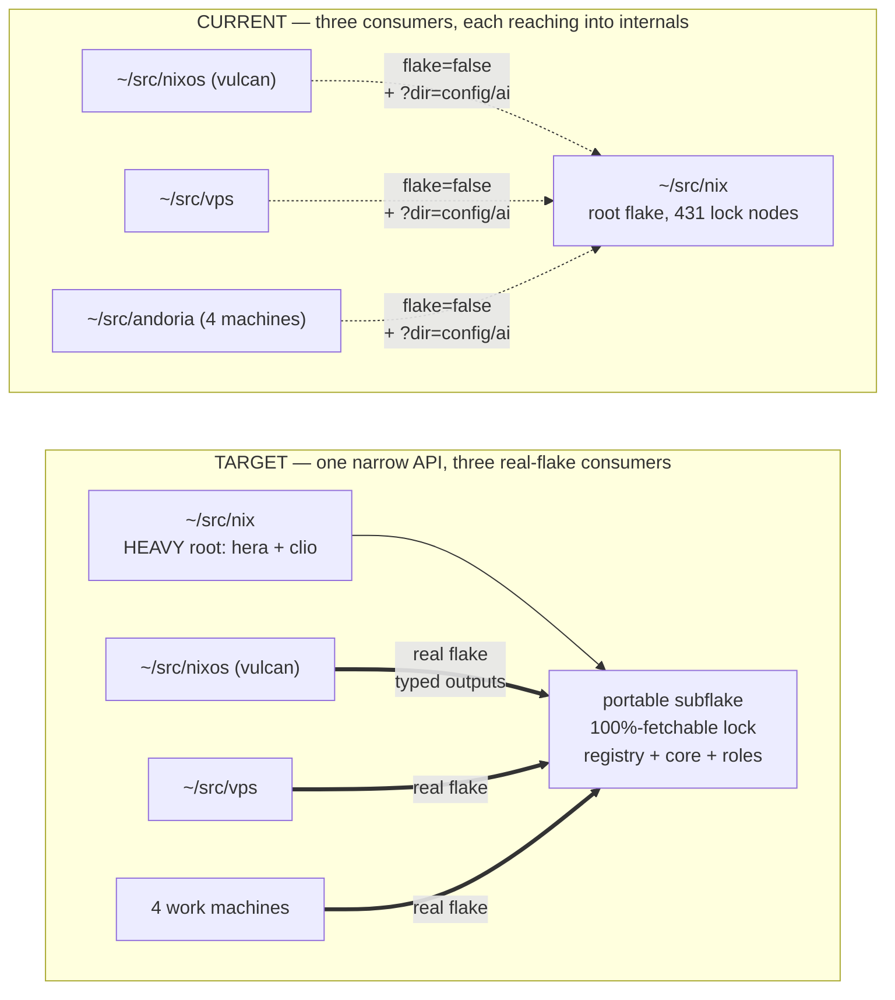
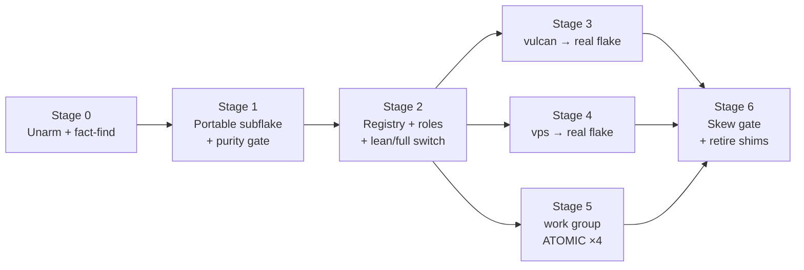

# Unified Fleet Configuration — Design Plan

A single master core, plus declared variants, for eight machines across three
activation models.

**Prepared** 2026-07-27 · **Branch** `design/unified-fleet` · **Status** design only; nothing implemented

---

## How to read this document

Every substantive claim carries its epistemic status. This matters more than usual
here, because the current architecture rests on at least one premise that turned
out to be false, and the investigation corrected three of its own positions along
the way.

| Badge | Meaning |
|---|---|
| **`VERIFIED`** | Proven on this machine by running it — command and output recorded |
| **`READ`** | Read directly from source or from the live repositories, with `file:line` |
| **`CITED`** | From external research, with URL and date; consensus vs. single-author noted |
| **`REFUTED`** | A position held earlier in this investigation and since disproven |
| **`OPEN`** | Genuinely undetermined; needs a decision or a check on a host |

Nothing below is asserted from memory or inference alone. Where the evidence
stopped short, the badge says `OPEN` rather than reaching for a conclusion.

---

## 1. The fleet

| Machine | OS | Activation | Arch | Role | Config |
|---|---|---|---|---|---|
| `hera` | macOS | nix-darwin + h-m | aarch64 | Personal, Work — **full** | `~/src/nix` |
| `clio` | macOS | nix-darwin + h-m | aarch64 | Personal, Work — lite | `~/src/nix` |
| `vulcan` | NixOS | NixOS + h-m | aarch64 | Personal (home server, large) | `~/src/nixos` |
| `vps` | NixOS | NixOS + h-m | amd64 | Personal (small VPS) | `~/src/vps` |
| `andoria-08` | Ubuntu | h-m standalone | amd64 | Work | `~/src/andoria` |
| `andoria-t2` | Ubuntu | h-m standalone | amd64 | Work | `~/src/andoria` |
| `delphi-3bd4` | Ubuntu | h-m standalone | amd64 | Work | `~/src/andoria` |
| `gpu-server` | Ubuntu | h-m standalone | amd64 | Work | `~/src/andoria` |

The four work machines **share one `$HOME` over NFS**. That single fact drives
more of this design than anything else.

### Requirements, treated as binding

- **R1** — Vulcan's *system* configuration stays out of `~/src/nix`. Only its
  home-manager core is shared.
- **R2** — The h-m core is shared by every host, parameterized by environment:
  username, email, keys, GnuPG signing.
- **R3** — Full h-m realizes only on `clio` and `hera`.
- **R4** — The nix-darwin core is shared by `clio` and `hera`; full only on `hera`.
- **R5** — Per-host paths must diverge on the four work machines despite the
  shared `$HOME`.
- **R6** — Remote hosts must not fetch or realize what they do not need.

---

## 2. Relationship to issue #15

`CLAUDE.md` names [issue #15](https://github.com/jwiegley/nix-config/issues/15) as
the *exclusive* authority for architecture remediation. This plan **extends** it and
does not compete with it. Reading the issue changes the framing substantially.

**Already completed there** — and therefore load-bearing assumptions, not proposals:

| Item | What it established |
|---|---|
| P1-5, P1-6 (WU3, `a3cc3843`) | Overlays are **explicit input factories**; `config/overlays.nix` is the sole phase/order authority; `pkgs.inputs` and `config/paths.nix` removed |
| P1-7 (WU6) | `config/ai/inputs.nix` is the single URL/membership authority; **dual locks retained deliberately**, with a transitive-drift oracle |
| P1-15, P1-16 (WU5) | Explicit home role/class, no username inference; one data module owns package groups and capability gates |
| WU5 | One host-to-output routing table for hera, clio, vulcan, vps |

**Still open there**, and touching this design: P0-1 (atomic update ownership —
the source-catalog work in flight now), P1-9 (wrapper implementations), P1-10
(quality policy encoded five times), P1-11 (checks claiming evidence they do not
produce), P1-13 (Anvil source container), and **P2-19**, which explicitly names
`flake-ai.nix` as a compatibility surface requiring a consumer inventory before
deletion.

**What is genuinely new here.** Issue #15 scopes itself to the canonical
repository. Every finding below concerns the *consumer* side — `~/src/nixos`,
`~/src/vps`, `~/src/andoria` — or the fleet-portability seam between them, which
that scope excludes. Issue #15's own Definition of Done nonetheless demands
"fleet portability" and native builds on Andoria and Vulcan, so this is the
missing half rather than a parallel effort.

> **On PAL consensus.** The `/wiggum` methodology asks for multi-model consensus on
> significant designs. Issue #15 states: *"PAL consensus was explicitly waived;
> independent fess and partner review remain required after each work unit."* That
> waiver is honored here — this plan was instead verified empirically, audited by an
> independent `fess` pass, and adversarially critiqued. Say the word if you would
> like PAL run anyway.

---

## 3. Act on this first — two hosts are armed to break

**`READ` + `VERIFIED`.** This is independent of everything else in the plan and
should not wait for it.

WU3's completed work (`a3cc3843`, "explicit input factories") changed several
overlays from two-level `final: prev:` functions to **three-level** factories
taking a *strict* argument set with no `...`:

| Overlay | Signature at HEAD | Positional call |
|---|---|---|
| `30-misc-tools.nix` | `_final: prev:` | works |
| `30-markless.nix` | `_final: prev:` | works |
| `30-data-tools.nix` | `{ dirscan ? null, }: _final: prev:` | **breaks** |
| `30-text-tools.nix` | `{ org2tc ? null, }: _final: prev:` | **breaks** |
| `30-user-scripts.nix` | `{ scripts ? null, }: final: prev:` | **breaks** |
| `30-git-tools.nix` | `{ gitScripts ? null, }: _final: prev:` | **breaks** |

Two consumers still call those files **positionally**, passing `final` — the whole
package set — where `{ dirscan ? null, }` is expected. Nix rejects it:
`function called with unexpected argument`.

| Consumer | Armed call sites | Locked rev | Distance from `a3cc3843` | Status |
|---|---|---|---|---|
| `vulcan` | 3 — `tsvutils`, `filetags`, `nix-scripts` | `a36d3f51` | **9 commits before** | breaks on next bump |
| `vps` | 1 — `nix-scripts` (in johnw's package list) | `1b71b192` | **19 commits before** | breaks on next bump |
| `andoria` | none | `269b518e` | at/after | **unaffected** |

`a36d3f51` is also issue #15's own recorded audit baseline, so Vulcan is pinned
exactly at the pre-remediation revision.

### Why Andoria survived, and why that settles the architecture

Andoria is already *past* the breaking commit and works fine — because it does not
cherry-pick overlay files at all. It calls the aggregator:

```nix
(import "${inputs.nix-config}/config/overlays.nix" {
  inherit inputs;
  aiOverlay = inputs.nix-config-ai.overlays.default;
})
```

which owns both the `00`→`30` phase order and every per-overlay argument set.

> This is a natural experiment, not an argument. The consumer using the supported
> entry point **survived** a deliberate breaking change to the internals. The two
> consumers reaching past it are armed to fail. No amount of more careful path
> interpolation would have helped; a stable public API would have.

Under issue #15's own behavioral-parity guard — *"preserve package availability on
every consumer where it previously worked"* — this is a latent violation.

**Interim fix, no architecture required.** Route Vulcan's and VPS's overlay
consumption through `config/overlays.nix` as Andoria already does, or pass the
argument sets explicitly. Then bump their locks.

---

## 4. Diagnosis

### 4.1 `flake = false` erased the module API

**`READ`.** Consuming the repo as a source tree means consumers interpolate paths
into internals, with **zero** compatibility surface:

| Consumer | Site | Reaches into |
|---|---|---|
| vulcan | `modules/users/home-manager/johnw.nix:26` | hand-calls `config/packages.nix` |
| vulcan | `overlays/default.nix:31,298,303,306` | cherry-picks attributes from individual overlay files, manually rebuilding `prevWithMyLib` |
| vulcan | `flake.nix:313,326` | rebuilds the same ordering a second time |
| vps | `overlays/default.nix:17-18` | same pattern for `nix-scripts` |
| andoria | `flake.nix:410,431` | `johnw.nix`, `packages.nix` by path |

The overlay *composition order* is an implicit contract each consumer reproduces by
hand. All three do it independently.

### 4.2 The closure rationale is refuted — and the real problem is elsewhere

**`VERIFIED`.** The `flake.nix` / `flake-ai.nix` split exists so remote hosts need
not realize everything. That belief was tested on `hera` with a flake whose sibling
output is a `throw`:

```nix
packages.aarch64-darwin.good     = runCommand "good" { } "echo ok > $out";
packages.aarch64-darwin.landmine = throw "LANDMINE EVALUATED -- outputs are NOT lazy";
```

`nix build --no-link '.#good'` **succeeded**. Flake outputs are lazy; a Linux host
building its own home configuration never evaluates `darwinConfigurations.hera`.

`nix flake check` **failed** on the landmine — it forces every output. That is the
one genuine monorepo cost, addressed in §8.

Also `VERIFIED`: `nix (Determinate Nix 3.21.7) 2.34.8`, `lazy-trees = true`. Lazy
trees retire the old source-ingestion argument too.

**So R6 is a lock-time property, not a build-time one.** What matters is the input
graph a consumer *locks*, never the closure it *builds*.

**And the actual bloat lives inside the h-m core.** **`READ`.** `~/src/vps`'s
wrapper is 35 `mkForce` uses of closure surgery, sizes quoted from its own comments:

| Removed on vps | Cost |
|---|---|
| `programs.git-ai` | ~2.3 GB Rust toolchain |
| `programs.vim` | vim-full + GTK3, ~500 MB |
| `programs.password-store` | ~432 MB |
| `programs.info` | 123 MB |
| `xdg.configFile."aspell/config"` | ~110 MB |

Worse, because `vars.gitPkg` is **string-interpolated into option values**, vps must
rewrite **12 `programs.git.settings`** entries and **5 `programs.zsh.shellAliases`**
one at a time, swapping an embedded `gitPkg` store path for `gitMinimal`. Three
`sessionVariables` are blanked because — its comment — *"their string interpolations
pull those packages into the closure."*

Fleet override debt: **46 `mkForce` uses** (vps 35, vulcan 6, andoria 5) **plus 920
vendored lines**.

> The flake split was fixing the wrong layer. The highest-leverage change available
> is a lean/full capability switch in the core — §6.4 — and it is independent of
> repository topology.

### 4.3 Version skew costs two hosts two different workarounds

**`READ`.** The core targets master-only `programs.ssh.settings`. Vulcan and vps
both pin `home-manager/release-25.11`:

- **vulcan** wrote `modules/users/home-manager/ssh-settings-compat.nix`, translating
  `settings` → `matchBlocks`.
- **vps** vendored **920 lines** of upstream master verbatim at
  `modules/home-manager/ssh-rfc42.nix`, swapped in via `sharedModules` +
  `disabledModules`.

Same root cause, two substantial and divergent workarounds. There is no CI gate
that would have caught it.

The `git-ai` story is the same shape. `config/johnw.nix:54-56` imports the module
*guarded* on `inputs ? git-ai`, but `:220-246` assigns `programs.git-ai`
**unconditionally**. So vps keeps an entire flake input — with its `nixpkgs`
follows — purely so the assignment type-checks before force-disabling it, while
vulcan fabricates a freeform option stub instead.

### 4.4 The second identity does not exist

**`READ`.** `config/vars.nix:15-18` binds identity as `let` constants
(`userEmail = "johnw@newartisans.com"`). `config/git.nix:141-142` assigns
`name`/`email` at **plain priority** — pointedly, since the same file uses
`lib.mkDefault` for `editor` (`:146`), `commit.gpgsign` (`:155`), and
`credential.helper` (`:158`). A grep across all three consumer repos finds **no**
override of `user.email` or `user.name` for johnw/jwiegley.

> The four work machines author git commits as
> `John Wiegley <johnw@newartisans.com>`. `jwiegley@positron.ai` exists only as a
> Fastmail *alias* in `config/email.nix:24`, never as a git identity.

Because the assignment is at plain priority, a consumer cannot `mkDefault` over it —
only `mkForce` would work. This is exactly the parameterization gap R2 asks to close.

### 4.5 Duplicate fetch, and a routing table that covers half the fleet

**`READ`.** Each consumer fetches the repo twice — the whole tree as
`flake = false`, plus `?dir=config/ai` as a real flake. Two lock nodes for one
repository. All three are currently pinned to the *same* revision, so the drift
hazard is real but has not bitten.

The core also has **two remotes** — `origin` (gitea, LAN-only) and `github` — and
consumers split across them: vulcan uses gitea, andoria and vps use github. A core
change is invisible to some hosts until pushed to **both**. At the time of writing
`main` is **9 commits ahead of both**.

And WU5's routing table stops short of the work fleet. `bin/lib/host-routing.sh`
normalizes `hera`, `clio`, `vulcan`, `vps` — **and has no case for the four work
machines**. They fall through `bin/switch:24-26`:

```bash
elif [[ -d $HOME/.config/home-manager ]]; then
    cd "$HOME/.config/home-manager"
    exec nix run home-manager/master -- switch
```

No flake attribute, so the h-m CLI's auto-detection decides — and `nix run
home-manager/master` pins h-m at *runtime*, independent of the flake's own input.
Two skew vectors in three lines.

---

## 5. The shared `$HOME` — where the real hazards are

### 5.1 Uniformity is load-bearing, not accidental

**`CITED` + `READ`.** Home-manager's state model *"assumes one active writer per
home directory."* Its file linker is **`$HOME`-anchored**: `modules/files.nix` types
`home.file` against `homeDirectory` and errors with *"Error installing file outside
`$HOME`"*; `xdg.configFile` and friends are built **on top of** `home.file` by bare
concatenation.

The four machines do not collide **only because they build one byte-identical
derivation**, so every shared symlink resolves on any host.

> **`REFUTED`.** Earlier in this investigation I proposed redirecting the four XDG
> base directories to host-local storage, keeping `$HOME` for shared data. That is
> wrong and is recorded rather than quietly dropped. The XDG *environment variables*
> govern where applications look at **runtime**; they do not change where h-m
> **links**. Redirect the variable while h-m still links into `~/.config` and
> applications never see h-m's files at all — decoupling breaks delivery.
>
> A hard core has no XDG escape at any price: `~/.ssh/config` (fixed path, no
> option), `.bashrc`, `.profile`, and any `home.file` dotfile. Partial escapes exist
> for `~/.gnupg` (`programs.gpg.homedir`), `.zshrc` (`programs.zsh.dotDir`), and
> `~/.nix-profile` (moves under `xdg.stateHome` when `nix.useXdg = true`).

The corollary matters: **the runtime `hostname` detection in `~/src/andoria` is
load-bearing, not a hack.** By resolving per-host paths at runtime it keeps the
built derivation byte-identical, and that uniformity is what makes the shared
`$HOME` safe. Declaring four per-host configurations would break a property the
current design quietly relies on.

### 5.2 State isolation cannot be declarative

**`READ`.** From the pinned h-m CLI (rev `deeb6b7e`) and
`modules/lib-bash/activation-init.sh` `setupVars()` — two independent code paths,
same answer:

```bash
declare -r stateHome="${XDG_STATE_HOME:-$HOME/.local/state}"
declare -gr HM_STATE_DIR="$stateHome/home-manager"
declare -gr currentGenGcPath="$hmGcrootsDir/current-home"
if [[ -d $userNixStateDir/profiles ]]; then HM_PROFILE_DIR="$userNixStateDir/profiles"
elif [[ -d $globalProfilesDir ]]; then HM_PROFILE_DIR="$globalProfilesDir"
```

Every root *location* is a runtime `${VAR:-default}` expansion; only the store path
being rooted is build-time. And the CLI **injects** `xdg.stateHome` into the
generated config *from* the variable — the flow is environment → option.

So `XDG_STATE_HOME` must be exported **before** `home-manager switch`. Setting the
option alone is not merely insufficient; it produces two silently disagreeing
sources of truth, since `home.profileDirectory` *does* read the evaluated option.

**A latent trap worth naming.** The profile-directory choice is *existence-gated*.
If `~/.local/state/nix/profiles` does not exist, each machine uses its own
host-local system profile and there is **no collision**. The moment **any one**
machine creates that directory in the shared home, **all four** silently switch onto
one NFS profile with a single generation series — no error, behaviour changing for
every host at once.

### 5.3 The GC hazard, stated precisely

> **`REFUTED`, then corrected.** I first reported that the shared `current-home`
> gcroot being overwritten lets GC reap a live closure. **That was too strong.**

**`READ`** from Nix C++ source. **Plain garbage collection is safe.**
`profiles.cc` `createGeneration` calls `addPermRoot` on *every* generation, and
`gc.cc` `addIndirectRoot` gives each `home-manager-N-link` its own
`gcroots/auto/<sha1>` entry, local to the host that built it. A new activation
elsewhere creates a *new-numbered* link and never touches existing ones.

The real hazard is **generation deletion**. `deleteOldGenerations` keeps only
`curGen = parseName(readLink(profile))` — the **last writer** on a shared profile —
and unlinks every other generation, removing its root. The next store GC then
collects those closures.

**Do not run these on the four work machines while the profile is shared:**

- `nix-collect-garbage -d` / `--delete-old` — per the manual, `-d` expires
  `$XDG_STATE_HOME/nix/profiles`, exactly where the h-m profile lives
- `home-manager expire-generations` / `--delete-older-than`
- `nix profile wipe-history`, `nix-env --delete-generations`
- **any automatic GC timer with a delete-old setting** — same trigger, unattended

**Safe:** plain `nix-collect-garbage` and `nix store gc`. They delete unreachable
paths without deleting generations.

A *documented, conditional* data-loss hazard. **`OPEN`:** no published incident
report exists, and per-generation rooting for non-standard profile locations is
undocumented in the Nix GC docs.

### 5.4 No published precedent

**`CITED`.** Three targeted searches found only discussion — Discourse #35880,
#68227, #69500, and `tiredofit/home` (single-machine portability). No working
recipe.

> N machines sharing one NFS `$HOME`, each running standalone home-manager, is
> **unsupported, DIY territory**. The design must therefore *assert and test* this
> invariant itself rather than trust upstream to preserve it.

---

## 6. Target architecture

### 6.1 The one-sentence shape

One repository, one narrow portable subflake exporting **real typed flake outputs**,
a **host registry** as the single source of truth, and per-host variance expressed
as **parameters and capability flags** rather than overrides.



Dotted edges are raw path interpolation with no compatibility surface. Solid edges
are typed outputs that break loudly at the boundary instead of silently inside an
imported file.

### 6.2 Retiring `flake = false`

**`VERIFIED`.** Only **two** inputs ever blocked real-flake consumption, out of 431
lock nodes (426 `github:`, 1 `git+file://`, 1 `git+ssh://`, 2 `path:`, plus `root`):

1. **`obr` → `org2jsonl`** at `file:///Users/johnw/src/org2jsonl`. `obr` is a
   *github* flake, but **its own committed lock** carries the laptop-local path.
   The root's own `org2jsonl` is github at a *different* revision. `obr` is
   referenced in exactly one place, `config/packages.nix:37`.
   - *Local fix:* `inputs.obr.inputs.org2jsonl.follows = "org2jsonl";`
   - *Durable fix:* update `jwiegley/obr`'s own lock upstream. Prefer this.
   - *Caveat* `CITED`: Nix #14339 — removing a `follows` later does not respect the
     dependency's own lock, so treat it as permanent.
2. **`stock-trader`** at `git+ssh://gitea` (LAN-only), feeding only
   `overlays/30-stock-trader-mcp.nix`, which already tolerates absence via
   `inputs.stock-trader or null`.

Neither is architectural. **The cleanest resolution is structural exclusion rather
than a `follows` patch:** keep both out of the *portable* subflake's inputs
entirely, so they can never enter a remote consumer's lock. The `follows` fix
remains useful as root hygiene.

**`VERIFIED` — topology decided: promote the existing subflake, renamed
`config/fleet`.** A hermetic 3-level nest settled this by measurement rather than
argument.

| Option | Locks | Measured outcome |
|---|---|---|
| **A** — the existing subflake *becomes* the fleet core | **2** | Two is the floor and cannot go lower: root must own a lock as hera/clio's top flake, and a consumer-facing subflake must own one to be fetched as a real typed flake. This subflake already *is* that, with a clean 24-node github lock. |
| **B** — add a new `config/` level taking `ai = path:./ai` | **3** | The middle lock **re-records** the child's inputs. Measured node lists: child `['real','root']`, mid `['child','real','root']`, root `['child','mid','real','root']` — the same rev written independently into all three. Your real root lock already flattens the AI graph this way (`pal-mcp-server`, `pi-btw`, `llm-agents`, `mcp-remote`, `git-ai` are all root nodes), so B would be a *third* copy. |

**The clincher.** The subflake's lock contains **none** of `obr`,
`org2jsonl` (`file://`), or `stock-trader` (`git+ssh`). Consumers entering through
it therefore sidestep **both** real-flake blockers for free — something root
consumption cannot do. The `obr` follows-fix drops from precondition to optional
hygiene.

Two operational facts, both measured:

- **A committed subflake lock is mandatory.** Remote `?dir=` **hard-errors**
  without one — `cannot write modified lock file` — *both offline and online*,
  because the blocker is the write, not the fetch. The only bypass,
  `--no-write-lock-file`, re-resolves inputs fresh on every eval and is not viable
  for fleet activation.
- **A trap that would have produced a false pass.** A `git+file://` local path is
  treated as **mutable**: Nix silently wrote the lock back into the test worktree,
  masking the failure entirely. Only a read-only tarball reproduced the real
  behaviour. Any verification of this topology must use an immutable fetcher.

**Drift is real, not theoretical.** A controlled moving-upstream test: with a fresh
middle lock Nix *inherits* the child's pin, but an **independent** update diverges —
`nix flake update` on the child alone leaves the middle pinned to the old rev, so
the same logical input resolves differently depending on which lock you enter
through. The subflake has ~20 inputs with **no `rev` in `original`** (moving refs),
so every lock copy drifts on its own cadence. Hence the single-writer rule in §8.2.

**Renamed to `config/fleet`.** Once the subflake hosts the whole fleet core, `ai` is
the wrong name. This is a deliberate break of the `?dir=config/ai` contract named in
`CLAUDE.md`, chosen for honesty over continuity, and it touches three local
consumers **and both remotes**.

- **Prerequisite.** `CLAUDE.md` requires that obsolete compatibility be deleted only
  after all maintained consumers are searched, and issue #15's **P2-19** already
  mandates that inventory. So a consumer search precedes the rename — Stage 0.
- **Fail loudly, not obscurely.** Leave a `config/ai/flake.nix` that `throw`s a
  message pointing at `config/fleet`. A flake with no inputs adds no lock, so this
  costs nothing and turns a stale URL into a clear error instead of "not a flake".
  **Implementation correction (#47):** all three known consumers resolve
  `llm-agents.follows = "nix-config-ai/llm-agents"` before forcing the stub's
  outputs. The stub therefore retains that one input key (with no committed stub
  lock) so the real consumer route reaches the actionable throw instead of failing
  first on a missing follows target.
- **Constraint to respect.** The subflake imports `../../flake-ai.nix` and
  `../../test/ai/compatibility-check.nix`, so it can only ever be consumed as
  `?dir=` *of the whole repo*, never as a standalone fetch of the subtree. That is
  true today and works in production; it just must stay true.

### 6.3 The host registry

One declarative table is the source of truth; a small hand-rolled lib derives every
configuration from it. **`CITED`:** consensus favours one *parameterized* builder;
a zoo of `mkWorkstation`/`mkServer` constructors is a named anti-pattern, as is
`readDir` auto-discovery — which would worsen the very ordering opacity that broke
Vulcan.

Keep the **existing `johnw.*` namespace**. `johnw.anvil` and `johnw.agentDeck`
already ship; renaming to `my.*` is churn with no correctness payoff.

```nix
# config/hosts/registry.nix — the single source of truth
let
  personal = {
    userName = "John Wiegley";
    userEmail = "johnw@newartisans.com";
    signingKey = "12D70076AB504679";
    signing = "openpgp";
  };
  work = {
    userName = "John Wiegley";
    userEmail = "jwiegley@positron.ai";   # closes §4.4
    signing = "none";
  };
in
{
  hera = personal // {
    system = "aarch64-darwin"; activation = "darwin"; username = "johnw";
    roles = [ "workstation-full" "darwin-full" "ai-heavy" ];
  };
  clio = personal // {
    system = "aarch64-darwin"; activation = "darwin"; username = "johnw";
    roles = [ "workstation-lite" "darwin-core" "ai-client" ];
  };
  vulcan = personal // {
    system = "aarch64-linux"; activation = "nixos-module"; username = "johnw";
    roles = [ "server-headless" "ai-client" ];
    hmRelease = "25.11";              # declares the skew, §6.5
  };
  vps = personal // {
    system = "x86_64-linux"; activation = "nixos-module"; username = "johnw";
    roles = [ "server-lean" ];        # replaces 35 mkForce, §6.4
    hmRelease = "25.11";
  };

  # ONE row for FOUR machines. `evalId` is a GROUP label, never a machine name —
  # this is what keeps the derivation byte-identical (§5.1).
  andoria = work // {
    system = "x86_64-linux"; activation = "home-standalone"; username = "jwiegley";
    roles = [ "shared-work" "ai-client" ];
    evalId = "andoria";
    sharedHome = {
      members = [ "andoria-08" "andoria-t2" "delphi-3bd4" "gpu-server" ];
      localStateRoot = "/var/lib/jwiegley";   # decided — §10 Q2
    };
  };
}
```

The schema is typed in `johnw.*` so a bad enum or a missing field is an eval error
rather than a silent wrong build:

```nix
options.johnw.host = {
  system     = mkOption { type = types.enum [ "aarch64-darwin" "aarch64-linux" "x86_64-linux" ]; };
  activation = mkOption { type = types.enum [ "darwin" "nixos-module" "home-standalone" ]; };
  username   = mkOption { type = types.str; };
  userEmail  = mkOption { type = types.str; };
  signing    = mkOption { type = types.enum [ "openpgp" "ssh" "none" ]; default = "none"; };
  roles      = mkOption { type = types.listOf types.str; default = [ ]; };
  hmRelease  = mkOption { type = types.nullOr types.str; default = null; };
  evalId     = mkOption {
    type = types.nullOr types.str; default = null;
    description = "Group label for shared-home fleets. Never a machine name.";
  };
};
```

### 6.4 Capability flags replace hostname string-compares

**`READ`.** Every raw `hostname ==` site tests some *property*. Name the property:

| Site | Property actually tested | Replacement |
|---|---|---|
| `home.nix:24` agent-deck Discord bridge | exactly one host runs the gateway | `johnw.agentDeck.singletonGateway` |
| `home.nix:27` dedicated Emacs | workstation-class host | role `workstation-*` |
| `fractal.nix:9` | hera only | `johnw.fractal.enable` |
| `darwin.nix:461` `max-jobs` | machine capacity | `johnw.host.buildCapacity` |
| `darwin.nix:479-480` builders | fleet topology | derived from registry |
| `darwin.nix:617` orientation | physical display | `johnw.darwin.dockOrientation` |
| `ssh.nix:125` vulcan localhost | *is this vulcan itself* | `johnw.host.isSelf "vulcan"` |
| `johnw.nix:63` `useHeadlessEmacs` | dedicated-Anvil Linux host | `johnw.anvil.dedicated` |
| `ai.nix:175` | role, already partly modelled | role `shared-work` |

The `useHeadlessEmacs` case deserves a note, because I overstated it earlier.
`config/anvil-hosts.nix` lists **all four** work machines in `dedicatedLinux`, so
the shared wrong hostname happens to yield the right answer. The decision is
*accidentally correct*, not broken. The defect is structural: the moment one work
machine needs a different answer, it silently gets the wrong one with no error.

**The lean/full switch — the highest-leverage change.** Two parts:

```nix
# 1. Servers opt IN, instead of forcing 35 things off.
johnw.profile.heavy = {
  gitAi          = mkEnableOption "git-ai (~2.3 GB Rust toolchain)";
  fullVim        = mkEnableOption "vim-full with GTK3 (~500 MB)";
  passwordStore  = mkEnableOption "pass and extensions (~432 MB)";
  texinfo        = mkEnableOption "info/texinfo (123 MB)";
  aspell         = mkEnableOption "aspell and dictionaries (~110 MB)";
};

# 2. Stop interpolating heavyweight store paths into option VALUES.
#    Today `vars.gitPkg` is baked into 12 git settings and 5 zsh aliases, so
#    disabling a feature does not remove it — each string needs surgery.
#    Reference the package through one indirection instead:
johnw.git.package = mkOption {
  type = types.package;
  default = if config.johnw.profile.heavy.gitAi then pkgs.git-ai else pkgs.git;
};
# ...and derive every alias from config.johnw.git.package, never from a `let` constant.
```

Also fix the unconditional assignment behind an optional input (§4.3): guard
`programs.git-ai = { ... }` with the same `inputs ? git-ai` condition that guards its
import. That alone lets vps drop a whole flake input and vulcan delete its stub.

Together these retire most of the 46 overrides and the three competing package
strategies (full list on darwin/vulcan/andoria, curated on vps).

### 6.5 Version skew becomes a gate, not a surprise

`hmRelease` in the registry declares the skew instead of discovering it. Two
mechanisms:

- **A capability-gated shim in the core**, so `programs.ssh.settings` works on both
  APIs. Vulcan's `ssh-settings-compat.nix` is promoted into the core and vps's 920
  vendored lines are deleted.
- **A CI gate that would have caught it.** A check instantiating the core against a
  *pinned older* h-m lib, forced to evaluate, in the same gate as lock purity. The
  repo already does something of this shape in
  `test/ai/home-manager-contract.nix` and
  `packages/anvil-mcp/home-manager-smoke.nix`, so the pattern exists to follow.

Without that gate, "supported within a dated floor" is aspirational and the exact
failure mode of §3 recurs.

---

## 7. Shared `$HOME`, concretely

**Branch chosen: keep the shared `$HOME`; make only h-m *state* host-local.** This
matches your own description of the machines as near-identical, requires no change
to how `$HOME` is mounted, and is where the fleet already sits. The alternative —
host-local `$HOME` with NFS data mounted in — is more robust and is the *only*
branch permitting genuinely divergent per-host builds, but needs sysadmin changes on
four work machines. Costed in §9, Q1.

**1 — One configuration, group-labelled.** Exactly one derivation for the group,
`evalId = "andoria"`. Never a machine name.

**2 — State host-local via the environment, at `/var/lib/jwiegley`.** Export
`XDG_STATE_HOME` (and `NIX_STATE_DIR`) in the login environment or PAM, *not* via
`xdg.stateHome`; set `nix.useXdg = true` so `~/.nix-profile` follows.

```
/var/lib/jwiegley/          # persistent, host-local, 0700, never tmpfiles-reaped
  state/                    # XDG_STATE_HOME — HM profile + gcroots
  cache/                    # XDG_CACHE_HOME — SQLite and lockfiles off NFS
  nix-local/profile         # gpu-server's second profile (§7.7)
  sops-age.key              # decryption identity, 0700 (§8.3)
```

`/var/lib` needs one-time root creation per machine — which folds into the same
provisioning step as `loginctl enable-linger`, so it adds no new class of work.

> **Not `/var/tmp`.** systemd-tmpfiles age-cleans it at 30 days, which would delete
> gcroots *and*, under the old plan, the age key with them. This pattern already has
> a foothold — `~/src/andoria/flake.nix:526` sets
> `xdg.cacheHome = "/var/tmp/jwiegley/xdg-cache"`. Cache-only, so survivable today
> since caches regenerate, but it must not be extended to state, and moving it is a
> free improvement while we are there.

**3 — Per-host values at runtime, in every context.** A unit's `Environment=`
genuinely cannot evaluate `$(hostname -s)` — systemd never invokes a shell for unit
directives, so it stores the literal string, and `$` in `Environment=` supports only
`${OTHER_VAR}` references. **But systemd has a native specifier that solves this
outright**, which is better than the wrapper this plan first proposed.

**`READ`** from systemd source: `specifier.c` `specifier_short_hostname()` calls
`gethostname_short_malloc()` — a **live** lookup at expansion time, not at build or
registration. `COMMON_SYSTEM_SPECIFIERS` maps `%l` (short host), `%H` (hostname),
`%m` (machine id). And `load-fragment.c` `config_parse_environ` calls
`unit_env_printf`, while `config_parse_exec` calls `unit_path_printf` /
`unit_full_printf` — all of which include those specifiers. So **`%l` expands in
`Environment=`, `ExecStart=`, `WorkingDirectory=`, and path directives** of user
units, to the live value, at unit-load time.

**In-repo precedent proves the mechanism is already live:**
`~/src/andoria/flake.nix:585` and `:599` already use `%h` in `ExecStart`. Home-manager
writes `%` verbatim and systemd expands it — `%l` is the identical mechanism.

| Context | Mechanism |
|---|---|
| login shell | `export HOSTNAME="$(hostname -s)"` in `initExtra` (zsh: `$HOST`) — the rc snippet embeds the *command*, so the derivation stays identical |
| non-login / non-interactive | read the shell-populated live `$HOSTNAME` / `$HOST`, or call `hostname -s` |
| h-m activation script | `host="$(hostname -s)"` in the script body — as `agentDeckHostLocalState` already does correctly |
| **systemd user unit** | **the `%l` specifier directly** — e.g. `ExecStart = "${pkg}/bin/foo --state-dir %h/.local/share/foo-hosts/%l"`. No wrapper, byte-identical store path, each host's user manager fills its own name |
| wrapper packages | `hostname -s` at exec, as the agent-deck wrapper already does |

**Two live bugs this fixes.** `config/johnw.nix:89` sets `HOSTNAME = hostname`,
baking `"andoria-08"` into `hm-session-vars.sh` **and clobbering bash's own live
`$HOSTNAME`** — so interactive shells see the wrong host while non-interactive ones
see the right one. Deleting that constant removes the split-brain. Separately,
`config/ssh.nix:28` bakes `IdentityFile = id_${hostname}` → `id_andoria-08` into
`~/.ssh/config` on all four machines; intentional or not, it should become an
explicit registry field rather than a hostname accident.

**`OPEN`, cheaply closable:** the specifier chain is verified from systemd source
(main branch) plus the running in-repo `%h` units, not from a live
`systemctl --user show -p Environment,ExecStart <unit>` on an Ubuntu host. The
specifiers are many years old so the risk is negligible, but one command on any work
machine after a switch would close it for good.

**4 — A second, separate systemd hazard.** h-m's generated units live in NFS-shared
`~/.config/systemd/user/` as symlinks into the **host-local** `/nix` store. That
works only while the derivation is uniform — which is another reason uniformity is
an asserted invariant, not a nicety.

**5 — Assert and test it.** A check that evaluates the group's `activationPackage`
`drvPath` under each of the four intended host names and **fails if it varies**.
Since no published precedent exists (§5.4), this invariant must be self-policed.

This gate is not hypothetical — it has a proven canary. Injecting the real
per-machine hostnames **was measured to diverge** the ssh-config derivation (two
distinct hashes). So the check has a known-failing input to validate itself against,
which is exactly what you want from an invariant gate.

**`VERIFIED` — the invariant holds today, by construction.** `andoria/flake.nix:70-71`
pins `system` and `hostname` as `let` constants and the flake reads **nothing** from
the build environment — no `builtins.getEnv`, no impure hostname. Four machines, one
`flake.nix` and one `flake.lock` over NFS, therefore one identical evaluation.
Divergence is impossible without an eval-time impurity, and there is none.

**7 — Per-host packages without breaking uniformity.** `gpu-server` needs nothing
extra today — `grep -rniE 'cuda|nvidia|torch|rocm|tensorrt|cudaSupport'` across the
andoria and core configs returns **zero** real hits, and the host has no
host-specific gating at all. When it does need something, use a **host-local second
profile** rather than diverging the build:

```nix
# In the shared config — a byte-identical constant string on all four machines.
home.sessionPath = [ "/var/lib/jwiegley/nix-local/profile/bin" ];
```

```bash
# On gpu-server only. Empty dir on the other three, so no effect there.
nix profile install --profile /var/lib/jwiegley/nix-local/profile <gpu packages>
```

Zero eval divergence, zero impact on the shared generation. The second profile is
self-gc-rooted via `addPermRoot`, so plain GC is safe; only generation-deletion *on
gpu-server* touches it. It must live on the host-local path — `nix profile`'s default
location is `XDG_STATE_HOME`-anchored and would land on the shared home and collide.

> **The fragility worth naming.** Byte-identity is not a property of the
> configuration; it is a property of pinning the hostname to a constant. The moment
> anyone adds a build-time decision distinguishing the four — or wires a real
> per-machine hostname into any `home.file` or `sessionVariable` — it breaks silently,
> with no error. That is precisely why item 5 is a gate and not a comment.

**8 — Rollout: the config is shared, but the four local Nix stores are not.** That
asymmetry governs the procedure, and it yields one hard invariant:

> Every store path referenced by the shared `$HOME` symlinks must already exist in
> **all four** local stores before *any* machine writes those symlinks.

Because `$HOME` is shared, the instant one machine activates, all four see the new
symlinks — and any machine whose store lacks those paths has dangling links until it
catches up. A naive "switch one, then the others in turn" therefore opens a breakage
window on three machines lasting until the last switch finishes.

**Copy-only is not sufficient either.** Three of the four activation steps have real
per-host effects: `hostLocalXdgCache` (`andoria/flake.nix:561`) runs
`mkdir -p /var/tmp/$USER/xdg-cache/nix`, creating a **host-local** directory that the
shared `~/.cache/nix` symlink then targets; `agentDeckHostLocalState` (`:528`) creates
`$HOME/.local/share/agent-deck-hosts/$(hostname -s)`; and `checkNoLocalPasswdEntry`
(`:468`) greps the *local* `/etc/passwd`. Copying paths alone would leave three machines
with `~/.cache/nix` pointing at a directory that does not exist there.

So pre-population is the **enabler** and the per-host switch is still **required**:

```bash
# 1. Realize once, then pre-populate the other three. Pull-based and parallel:
#    no push credentials, no hub dependency, and --substitute-on-destination
#    means only the delta crosses the network.
CAND=$(nix build --no-link --print-out-paths .#homeConfigurations."<attr>".activationPackage)
for h in andoria-t2 delphi-3bd4 gpu-server; do
  ssh "$h" nix copy --from ssh://andoria-08 --substitute-on-destination "$CAND" &
done; wait

# 2. Prove residency on all four BEFORE activating anything.
for h in andoria-08 andoria-t2 delphi-3bd4 gpu-server; do
  ssh "$h" nix path-info -r "$CAND" >/dev/null && echo "$h OK"
done

# 3. Pin the PREVIOUS closure on all four so rollback survives GC.
for h in andoria-08 andoria-t2 delphi-3bd4 gpu-server; do
  ssh "$h" nix build --out-link /var/lib/jwiegley/rollback-prev "$PREV"
done

# 4. Only now switch, per machine. Each switch is local and download-free, and
#    exists to run the per-host activation steps — not to realize the closure.
```

Efficient because the derivation is byte-identical, so the paths match and
pre-population is pure transfer with no rebuild — only one machine substitutes from the
network. Robust because the breakage window disappears: by the time the first symlink is
written, every machine can already resolve it.

**6 — Selection must fail loudly.** **`READ`:** the h-m CLI probes
`$USER@$(hostname -f)`, `$USER@$(hostname)`, `$USER@$(hostname -s)` with **no
`break`**, so the last match wins, then falls back to bare `$USER`. That bare
fallback *is* today's trap — all four machines match `homeConfigurations.jwiegley`.
Either keep exactly one deliberate group attribute and switch it **explicitly**, or
declare per-machine aliases; do not leave an ambiguous bare-username attribute that
silently serves the wrong host. `hostname -s` is the robust discriminator;
`hostname -f` depends on DNS and can hang.

---

## 8. Locks, gates, and secrets

### 8.1 Keep `nix flake check` off the hot path

**`VERIFIED`.** Two scratch flakes established that `nix flake check` **deeply**
forces host configurations — it failed on a *nested*
`homeConfigurations."alice@hostA".activationPackage`. That is **not** the eval cache:
reproduced with `--option eval-cache false`.

**`READ`:** upstream `src/nix/flake.cc` forces only `nixosConfigurations` and treats
`darwinConfigurations`/`homeConfigurations` as *"known but unchecked"*. So this is
**Determinate-specific**, and the exposure is not a Nix invariant:

| Implementation | Hosts forced by a root `nix flake check` |
|---|---|
| Determinate 2.34.8 (today) | **all 8** |
| Upstream master | **2** |

Two flag semantics matter: `--no-build` skips *realisation* only, not eval; and
`--all-systems` is irrelevant to `nixosConfigurations`, which never call
`checkSystemType`. **`CITED`:** Nix #11818, requesting output exclusion, is **closed
with no implementation** — there is no escape hatch.

**Your existing gates are already correct.** Pre-commit runs `nix flake check`
scoped to `./config/ai`, which declares **zero** host configurations; pre-push uses
targeted `nix build` of named checks. Consolidation therefore costs nothing *provided
that discipline is preserved*.

> **Design rule.** Never wire a root-level `nix flake check` into a routine or
> pre-commit gate. If a routine full-fleet gate is ever wanted, build it on
> **`nix-eval-jobs` / `nix-fast-build`** with `--check-cache-status` over explicit
> toplevel and `activationPackage` attributes — which is what large public fleets
> actually use; the NixOS Wiki CI page recommends `nix-fast-build` and does not
> mention `flake check`.

### 8.2 Lock policy

- **Two locks**, per issue #15's P1-7 — root and portable — with the existing
  transitive-drift oracle generalized to whatever topology §6.2 settles on.
- **One writer.** Update the AI input graph in exactly one place and regenerate the
  other; never both independently.
- **A purity check** asserting the portable lock is 100% fetchable, walking the
  **whole** closure rather than only root inputs. **`READ`:**
  `bin/update-overlay-test.py:872` currently iterates only
  `lock["nodes"]["root"]["inputs"]`, which is precisely why the transitive `obr`
  leak passes today. Deepening it turns "consumable as a real flake" into an
  enforced invariant and is the natural migration gate.
- **One publish path.** Today consumers split across gitea and github, so a change
  reaches some hosts and not others. Pick one, or make pushing to both a single
  scripted step.

### 8.3 Secrets

**`CITED`, verified from module source.** `sops-nix` is the choice — already used on
**both** NixOS hosts, and it covers all three contexts, which agenix does not do
better here once its one advantage is neutralized.

| Context | Delivery | Notes |
|---|---|---|
| NixOS (vulcan, vps) | systemd `LoadCredential`, else `EnvironmentFile` | `LoadCredential` avoids the environment entirely; systemd's own docs say env vars are unsuitable for secrets |
| darwin (hera, clio) | launchd agent | first-class in sops-nix |
| rootless h-m (4 work) | systemd **user** service | **no `home.activation` fallback exists** in either tool |

Non-negotiables:

- **`path = "%r/secrets/<name>"`.** sops-nix's h-m `path` defaults under
  `xdg.configHome` → four machines write symlinks into one NFS directory, each
  targeting its own `$XDG_RUNTIME_DIR`, so from any other host the link dangles.
  `%r` makes the visible path host-local too. (agenix defaults host-local; this
  closes the gap.)
- **String identity paths, never Nix paths.** A path literal copies the private key
  into the world-readable store.
- **Identity is not a secret.** Email, signing key id, and `user.signingkey` are
  parameters (§6.3). Private keys stay in `~/.gnupg` / `~/.ssh` or are delivered to
  `/run` — never the store.
- **`loginctl enable-linger jwiegley`, per machine, imperatively.**
  `users.users.<name>.linger` is NixOS-only; linger is host-local state under
  `/var/lib` and does **not** propagate through the shared home. Required here
  because your long-lived tmux sessions mean secrets must survive logout. The design
  should state this as an imperative provisioning step rather than pretend it is
  declarative.
- **The age key lives at `/var/lib/jwiegley/sops-age.key`, mode `0700`.** Persistent,
  host-local, never swept. Today it sits on the **shared NFS home** — a decryption
  key on a network filesystem — so relocating it is a security improvement
  independent of everything else here. Getting it onto each of four machines is
  necessarily out-of-band; that runbook is a Stage-5 deliverable, not an
  afterthought.

**Trust domain: one identity now, structured to split later.** The four machines are
treated as a single trust domain — one age recipient, one key, relocated off NFS.
But `.sops.yaml` is written with a **named group** from day one, so moving to
per-host keys is a recipient-list change plus `sops updatekeys`, never a
re-architecture:

```yaml
keys:
  - &work_group age1...        # one key today; four entries later
creation_rules:
  - path_regex: work/.*
    key_groups:
      - age: [ *work_group ]
```

The trade-off accepted: any one machine compromised exposes the group's secrets.
Revocation is all-or-nothing until the split happens. That is the right call while
all four are equally yours and equally exposed — and `/var/lib/jwiegley` is what
makes the split practical whenever that stops being true.

---

## 9. Staged migration

Every stage is independently verifiable and revertible. No stage requires a
flag-day across the fleet.



| # | Stage | Verify | Rollback |
|---|---|---|---|
| **0** | **Unarm §3** — route vulcan + vps overlay consumption through `config/overlays.nix`; bump their locks. **Fact-find:** `/nix` host-local on all four? auto-GC timer with delete-old? which profile branch h-m takes? **Inventory `?dir=config/ai` consumers** (issue #15 P2-19) before the rename. *(gpu-server divergence: already answered — none)* | `nix build` each host's HM activationPackage at the *new* lock; the three previously-armed packages still resolve | Revert the two consumer commits; locks return to `a36d3f51` / `1b71b192` |
| **1** | Create the portable subflake per §6.2 with a 100%-fetchable lock; deepen the purity check to the whole closure | Purity check passes; `nix flake metadata` + a trivial `nix eval` of the remote URL **from a clean store**, over *both* real fetchers (github tarball **and** `git+ssh://gitea`) | Delete the subflake; no consumer points at it yet |
| **2** | Registry, roles, capability flags, lean/full switch. Refactor-only — no consumer moves | **drvPath parity**: `hera`, `clio`, and the work group must hash identically to a baseline captured *before any edit*. If parity fails, bisect by re-introducing overlay list-vs-composed application and `specialArgs` names one at a time | Revert; parity baseline proves the pre-state |
| **3** | vulcan consumes typed outputs; delete its cherry-picks and `prevWithMyLib` | Native aarch64-linux build; package set diffed against baseline; `tsvutils`/`filetags`/`nix-scripts` present | Restore `flake = false` input; vulcan's lock is authoritative in its own checkout |
| **4** | vps likewise; adopt `server-lean` role, delete 35 `mkForce` and the 920 vendored lines | Native x86_64-linux build; package multiset diffed; closure size compared — must not grow | As Stage 3 |
| **5** | **The four work machines. Pre-populate all four stores, THEN switch each.** See §7.8 — the config is shared but the four local Nix stores are not, so store realization is staged deliberately while the shared-symlink write is effectively atomic. | Prove the candidate closure is resident in **all four** stores (`nix path-info -r`) and the previous closure is gcroot-pinned on all four, *before* any activation. Then switch per machine; verify each `~/.nix-profile` resolves and each unit symlink is live before releasing the next. Remove the old `~/.config/home-manager` entry point **in the same step** so a straggler cannot re-activate over the new symlinks. Then relocate state per §7 and **verify across a reboot** — or a simulated wipe of `localStateRoot` — with `home-manager generations` plus a no-op switch | **Depends on where the profile link lives.** While it is shared (today), rollback is **group-level**: one link move affects all four. After state moves to `/var/lib/jwiegley`, each machine has its own profile and generation series, so **state rollback becomes per-host**. Either way the pinned previous closure must exist on all four first |
| **6** | The skew gate (§6.5); retire vulcan's shim and vps's vendored module; inventory `flake-ai.nix` consumers per issue #15 P2-19 | Core evaluates against both h-m libs in CI; both hosts build with the shims deleted | Re-add the shims; they are additive |

**Why Stage 5 cannot be per-host.** The shared `$HOME` means you cannot have
`andoria-08` on the new generation while `delphi-3bd4` is on the old one — the
shared `~/.config` symlinks point into one machine's store paths. This is the one
place the plan admits an atomic cutover, and it is bounded to four machines that
already move as a unit.

### Explicitly not doing

- **Not** moving Vulcan's system configuration into `~/src/nix` — R1.
- **Not** adopting flake-parts, snowfall-lib, or the dendritic pattern. **`CITED`:**
  snowfall is parked; all three judge lenses rejected a framework here; and
  dendritic's `import-tree` is the same `readDir` auto-discovery the community
  anti-patterns document warns against — it would *worsen* the ordering opacity that
  broke Vulcan.
- **Not** renaming `johnw.*` to `my.*` — churn without payoff.
- **Not** relocating `config/ai` in a way that breaks the `?dir=config/ai` contract.
- **Not** giving the four work machines four divergent builds under a shared `$HOME`.
- **Not** activating, pushing, or rewriting history under this plan.

---

## 10. Decisions taken

All seven resolved 2026-07-27. Where evidence settled a question rather than
preference, the evidence is named.

| # | Question | Decision | Basis |
|---|---|---|---|
| **Q1** | Shared `$HOME`, or host-local `$HOME` with NFS data mounted in? | **Shared `$HOME`; only h-m *state* goes host-local.** | Evidence, not preference. Byte-identity holds by construction (§7.5), and the second-profile pattern covers the one case that would have forced host-local `$HOME`. |
| **Q2** | Where does host-local state live? | **`/var/lib/jwiegley`** — `state/`, `cache/`, `nix-local/`, `sops-age.key`. | Persistent, never tmpfiles-reaped, `0700`-able. One-time root creation folds into the `enable-linger` provisioning step. |
| **Q3** | Are the four work machines one trust domain? | **One identity now, `.sops.yaml` structured to split later.** Key moves off NFS to `/var/lib/jwiegley/sops-age.key`. | Splitting becomes a recipient-list change, not a re-architecture. Accepts group-wide blast radius while all four are equally exposed. |
| **Q4** | Does `gpu-server` need packages the others lack? | **No.** Zero GPU/CUDA hits anywhere; no host-specific gating. Future needs go to a **host-local second profile**. | `grep -rniE 'cuda\|nvidia\|torch\|rocm\|tensorrt\|cudaSupport'` returns no real hits. Injecting real hostnames was *measured* to diverge the ssh-config drv — so uniformity must be preserved, not "fixed". |
| **Q5** | Two locks or three? | **Two — the existing subflake becomes the fleet core.** | Hermetic proof: a middle level re-records the child's inputs (measured node lists). The subflake's lock also contains none of the two real-flake blockers, so consumers sidestep them for free. |
| **Q5a** | Keep the `config/ai` name or rename? | **Rename to `config/fleet`**, accepting URL churn across three consumers and both remotes. Honesty over continuity. | Deliberate break of the `CLAUDE.md` contract. Gated on the P2-19 consumer inventory; stale URLs get a `throw`ing stub so they fail loudly. |
| **Q6** | One publish remote or dual push? | **Scripted dual push**; both remotes stay authoritative. | Preserves vulcan's LAN-only path. Live proof of need: during this session `main` reached **7 ahead of gitea but 19 ahead of github**, so the work fleet was 19 behind while vulcan was 7 behind. |
| **Q7** | Merge `design/unified-fleet`? | **Merged to `main` locally, not pushed.** | Docs-only, conflict-free, signed. Rollback point `3a478b13`. Pushing remains separately authorized per `CLAUDE.md`. |

### Still to confirm on a host — cheap, and nothing blocks on them

| Check | Why it matters | Command |
|---|---|---|
| `%l` expansion in a *user* unit | The specifier chain is verified from systemd source and from the running in-repo `%h` units, but not from a live query | `systemctl --user show -p Environment,ExecStart <unit>` |
| `/nix` is host-local | The entire GC analysis assumes `/nix/store` and `/nix/var/nix` are per-machine | `findmnt /nix` |
| Which profile branch h-m takes | Existence-gated and version-dependent; determines whether the four already share a profile | `readlink ~/.nix-profile; ls -la ~/.local/state/nix/profiles; nix --version` |
| No automatic GC with delete-old | Same trigger as the manual hazard, but unattended | `systemctl list-timers \| grep -i nix` |

---

## 11. What this fixes

| Today | After |
|---|---|
| Consumers interpolate paths into internals; no compatibility surface | Typed flake outputs; breakage surfaces at the boundary, loudly |
| Two hosts armed to lose packages on next lock bump | Unarmed in Stage 0, before anything else |
| 46 `mkForce` + 920 vendored lines | A role selection and a capability switch |
| Work machines commit as `johnw@newartisans.com` | `jwiegley@positron.ai`, from the registry |
| Overlay order reconstructed by hand in three places | One aggregator, already the authority per P1-6 |
| Uniformity depended on silently, undocumented | Asserted invariant with a drvPath check |
| Generation-expiry can delete another host's live closure | Host-local state; hazard eliminated |
| Skew found by a host failing at lock-bump time | Found by CI at merge time |
| Routing table covers 4 of 8 hosts | Registry covers all 8 |

**Two things worth saying plainly.** The `flake.nix` / `flake-ai.nix` split was
solving a real problem at the wrong layer — outputs are lazy, so it bought nothing,
while the actual bloat sat inside the h-m core. And the four work machines are safe
today by a property nobody wrote down: they build one byte-identical derivation, and
the runtime `hostname` detection that looks like a workaround is what preserves it.
Any migration that adds per-host configs without addressing that will break working
services.

---

*Evidence base: `doc/UNIFIED-CONFIG-WIGGUM-PLAN.md` (frozen plan and Definition of
Done), `doc/UNIFIED-CONFIG-WIGGUM-HANDOFF.md` (findings F1–F14 with `file:line`),
`doc/UNIFIED-CONFIG-RESEARCH.md` (cited external research). Fifteen signed commits
on `design/unified-fleet`. Baseline green throughout: `nix flake check ./config/ai
--all-systems --no-build` exit 0 on all three systems; `bin/update-overlay-test.py`
20/20.*
